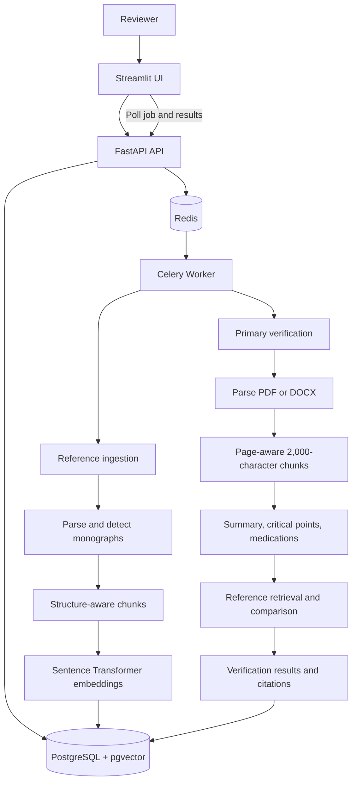

# Medical Document Verification System

An asynchronous document verification system that compares medication information in a primary medical document with an institutional reference or formulary document.

The project uses:

- **Streamlit** for the user interface.
- **FastAPI** for HTTP APIs.
- **Celery** for asynchronous processing.
- **PostgreSQL with pgvector** for document, job, evidence, and embedding persistence.
- **Redis** as the Celery broker/result backend.
- **Sentence Transformers** for text embeddings.
- **PyPDF2** and **python-docx** for document extraction.

## What The System Does

The system follows this workflow:

1. Authenticate the user.
2. Load an institutional reference document.
3. Upload or stage a primary PDF/DOCX document.
4. Start a verification job.
5. Process the job asynchronously through parsing, cleaning, chunking, embedding, extraction, and verification stages.
6. Poll the job status from the Streamlit UI.
7. Display extracted medications as `SUPPORTED`, `CONTRADICTED`, or `UNSUPPORTED`.
8. Display the supporting reference passage, page, section, and chunk identifier when available.

The Streamlit layer is intentionally a thin client. Parsing, chunking, embeddings, retrieval, extraction, verification, and citation creation belong to the backend and worker services.

## Repository Layout

```text
document-verification-system/
├── backend/
│   ├── app/
│   │   ├── api/                 # FastAPI routes
│   │   ├── core/                # Configuration and security concerns
│   │   ├── db/                  # SQLAlchemy models, repositories, migrations
│   │   ├── domain/              # Verification and ingestion services
│   │   ├── ingestion/            # Parsers, cleaning, and chunking utilities
│   │   ├── llm/                  # LLM client, extractors, explainers
│   │   ├── rag/                  # Embedding and retrieval components
│   │   └── workers/              # Celery application and tasks
│   ├── data/
│   │   ├── primary/              # Primary documents staged for processing
│   │   └── references/           # Reference documents staged for ingestion
│   └── requirements.txt
├── frontend/
│   ├── app.py                    # Streamlit application entry point
│   ├── api_client.py             # Streamlit-to-FastAPI client
│   └── requirements.txt
├── docker/
│   ├── docker-compose.yml
│   └── Dockerfile.worker
├── infra/                        # Kubernetes and Terraform definitions
└── tests/                        # Unit, API, integration, E2E, and evaluation tests
```

## High-Level Architecture



### Responsibility Boundaries

| Layer | Responsibility |
|---|---|
| Streamlit | User interaction, session state, loading/error states, progress and result rendering |
| FastAPI | Authentication, request validation, job creation, job status and result retrieval |
| Domain services | Reference ingestion and primary document verification workflows |
| Celery worker | Runs long-running processing outside the API request |
| PostgreSQL | Stores documents, jobs, stages, chunks, embeddings, and verification results |
| Redis | Queues asynchronous Celery work |

## Reference Document Processing

Reference ingestion is performed by `ReferenceIngestionService` in a Celery worker.

### Processing Sequence

```text
Reference file
    ↓
DOCX parsing
    ↓
Paragraph extraction
    ↓
Basic text cleaning
    ↓
Monograph/section detection
    ↓
Structure-aware chunking
    ↓
Embedding generation
    ↓
Reference chunk persistence
    ↓
Reference becomes available for retrieval
```

### Current Reference Flow

1. The Streamlit user selects a PDF or DOCX file.
2. The UI stages the file in the configured reference storage directory.
3. The UI calls `POST /api/v1/references`.
4. The current endpoint selects the first `.docx` file in `REFERENCE_STORAGE_PATH`.
5. The API creates a reference-document record and queues `reference_ingest_task`.
6. The worker parses the DOCX into non-empty paragraphs.
7. Basic cleaning normalizes whitespace and removes invisible extraction artifacts.
8. Short title-like paragraphs are treated as monograph boundaries.
9. Each monograph is chunked and embedded.
10. Chunks and metadata are stored in the reference chunk table.

### Current MVP Constraint

The reference ingestion service currently supports **DOCX only**, even though the Streamlit file picker accepts PDF and DOCX. PDF reference parsing is a planned extension. A PDF should not be treated as successfully ingested until PDF parsing is implemented in the backend.

## Primary Document Verification

Primary verification is performed by `DocumentVerificationService` in a Celery worker.

### Processing Sequence

```text
Primary file
    ↓
Parse PDF or DOCX
    ↓
Basic text cleaning
    ↓
Chunk extracted text
    ↓
Generate embeddings
    ↓
Generate summary
    ↓
Extract critical points
    ↓
Extract medication entities
    ↓
Retrieve matching reference chunks
    ↓
Compare medication parameters
    ↓
Persist verification results and evidence
    ↓
Complete job
```

### Verification Stages

Jobs expose these stages to the UI:

1. `parsed`
2. `chunked`
3. `embedded`
4. `summarized`
5. `key_points_extracted`
6. `entities_extracted`
7. `verified`
8. `done`

Each stage can be recorded as `STARTED`, `COMPLETED`, or `FAILED`. Stage records include timestamps, optional metadata, and an error message when processing fails. The Streamlit application polls `GET /api/v1/jobs/{job_id}` and renders only the state returned by the backend.

## Chunking Strategy

The project intentionally uses different chunking policies for reference documents and primary documents because they have different retrieval and verification needs.

### Reference Chunking: Structure-Aware, 3,000 Characters

Reference monographs are chunked by `ReferenceIngestionService.chunk_monograph`.

The strategy is:

1. Treat a monograph as the primary semantic unit.
2. Keep the complete monograph in one chunk when it is at most 3,000 characters.
3. For longer monographs, detect field boundaries using paragraph headings, lines ending in `:`, short title-case headings, and short uppercase headings.
4. Group adjacent fields without exceeding approximately 3,000 characters.
5. Split an oversized field only at paragraph boundaries.
6. Preserve the monograph title in every chunk's metadata.
7. Store source, section, page, and chunk-index metadata when available.

Conceptually:

```text
Monograph
├── Indication
├── Standard dose
├── Administration
├── Contraindications
└── Warnings
```

becomes a small number of complete field groups rather than arbitrary fragments.

### Why This Works For Reference Retrieval

- **Preserves meaning:** dose, route, timing, and warnings remain close together.
- **Improves matching:** medication name and monograph context are retained in chunk metadata.
- **Supports citations:** each retrieved chunk can retain its source section, page, and chunk identity.
- **Reduces irrelevant retrieval:** a complete field group is more useful than a fragment cut through a sentence.
- **Controls embedding size:** the 3,000-character limit prevents very large monographs from becoming unwieldy embedding units.
- **Handles long monographs safely:** oversized fields are split only between paragraphs, avoiding mid-paragraph truncation.

This policy is especially appropriate for a formulary because the document is usually organized around medication monographs and labeled clinical fields.

### Primary Chunking: Page-Aware, 2,000 Characters

The current primary workflow uses a simpler strategy in `_chunk_parsed`:

- For PDFs, text is extracted page by page.
- Each page is split into 2,000-character slices.
- Each chunk retains its page number.
- For DOCX files, paragraphs are combined into text and split into 2,000-character slices.
- DOCX page numbers are not currently reliable and are therefore left empty.

### Why This Works For The Primary MVP

- It is deterministic and inexpensive.
- It prevents an entire discharge summary from being passed as one oversized unit.
- Page metadata remains available for PDF evidence and review.
- It gives downstream extraction a bounded amount of text per processing unit.

### Known Tradeoff

Primary chunking is currently character-based and does not yet preserve paragraph or section boundaries. It is suitable for the MVP, but a future improvement should use paragraph-aware or section-aware grouping with a small overlap. That would reduce the risk of separating a medication name from its dose or timing when those details cross a 2,000-character boundary.

## Verification Classification

Each extracted medication receives one of three backend-defined statuses:

| Status | Meaning |
|---|---|
| `SUPPORTED` | The retrieved reference information matches the primary document parameters. |
| `CONTRADICTED` | A comparable parameter, such as dose, differs from the retrieved reference information. |
| `UNSUPPORTED` | No relevant reference passage was found for the medication. |

The UI does not calculate these classifications. It renders the status, comparisons, explanation, and evidence returned by the backend.

## Evidence And Citations

Verification results may include a `ReferenceEvidence` object containing:

- Medication name
- Reference document ID
- Page number, when available
- Section or monograph, when available
- Stored chunk ID
- Retrieval score
- Supporting passage text

For contradicted and unsupported results, the Streamlit UI displays the evidence in an expandable result item. If the backend returns no evidence, the UI explicitly shows:

```text
No supporting reference passage was retrieved.
```

The UI never invents a citation, page number, clinical recommendation, or verification result.

## API Surface

The current API is mounted under `/api/v1`.

| Method | Endpoint | Purpose |
|---|---|---|
| `POST` | `/api/v1/auth/login` | Basic demo username/password login |
| `POST` | `/api/v1/references` | Create and queue reference ingestion |
| `POST` | `/api/v1/primary-documents?reference_id={id}` | Create and queue primary verification |
| `GET` | `/api/v1/jobs/{job_id}` | Read job state and stage records |
| `GET` | `/api/v1/jobs/{job_id}/results` | Read persisted verification results |
| `GET` | `/health` | Check API availability |

The current primary and reference endpoints use configured storage folders. The Streamlit UI stages selected files into those folders before invoking the endpoints.

## Local Setup

### Prerequisites

- Python 3.11 or later
- Docker Desktop, if using the supplied infrastructure
- PostgreSQL with pgvector
- Redis
- A reference DOCX in `backend/data/references`
- A primary PDF or DOCX in `backend/data/primary`

### Install Backend Dependencies

```powershell
cd document-verification-system
python -m venv .venv
.\.venv\Scripts\Activate.ps1
pip install -r backend\requirements.txt
```

Install the UI dependencies:

```powershell
pip install -r frontend\requirements.txt
```

### Start Supporting Services With Docker

From `document-verification-system`:

```powershell
docker compose -f docker\docker-compose.yml up -d db redis rabbitmq db-init
```

The Celery worker image can then be started with:

```powershell
docker compose -f docker\docker-compose.yml up worker
```

The compose file currently provides the database, Redis, RabbitMQ, worker, and database initialization services. The API and Streamlit services are run locally with the commands below.

### Start The FastAPI API

From `document-verification-system`:

```powershell
$env:PYTHONPATH = (Get-Location).Path
uvicorn backend.app.main:app --reload --port 8000
```

Check the API:

```powershell
Invoke-RestMethod http://localhost:8000/health
```

### Start The Streamlit UI

In a second terminal:

```powershell
cd document-verification-system\frontend
streamlit run app.py
```

Open `http://localhost:8501`.

The default demo credentials are:

```text
Username: demo@example.com
Password: demo
```

These values can be changed with environment variables before starting the API:

```powershell
$env:DEMO_USERNAME = "reviewer@example.com"
$env:DEMO_PASSWORD = "change-me"
```

To point the UI at another API:

```powershell
$env:DOCUMENT_API_URL = "http://localhost:8000"
streamlit run app.py
```

## Streamlit Workflow

The UI stores presentation state in `st.session_state`, including:

- `authenticated`
- `access_token`
- `user`
- `reference_document_id`
- `primary_document_id`
- `job_id`
- `job_status`
- `verification_results`

The database remains the source of truth for jobs and results. When a job ID exists, the UI asks the backend for the latest status instead of assuming that a page refresh stopped processing.

## Testing And Validation

Compile the changed Python modules:

```powershell
python -m py_compile backend\app\api\v1\endpoints\auth.py backend\app\api\v1\endpoints\jobs.py backend\app\api\v1\endpoints\results.py backend\app\domain\document_verification_service.py frontend\api_client.py frontend\app.py
```

Run the test suite from the project root when the required database and worker dependencies are available:

```powershell
pytest
```

The repository contains unit, API, integration, end-to-end, and evaluation test areas. Tests that require PostgreSQL, pgvector, Redis, or Celery need those services running first.

## Current MVP Limitations

- Authentication is a simple demo username/password flow and is not a production identity system.
- The login token is a lightweight demo token; it is not a signed JWT or a complete authorization system.
- Reference ingestion currently parses DOCX only.
- Reference and primary uploads are staged into server-side folders because the current backend endpoints discover files from storage rather than accepting multipart uploads.
- The primary endpoint selects the first supported file in the primary storage folder. Keep only the intended primary document in that folder during a demo.
- Job polling is implemented; SSE/WebSocket streaming is not currently exposed by the backend.
- PDF rendering is supported by Streamlit when available; DOCX results provide file access rather than a full page-rendered viewer.
- Primary-document summarization and critical-point extraction are currently deterministic MVP logic in the backend service, not a separate production LLM pipeline.

## Recommended Next Improvements

1. Change reference and primary endpoints to accept multipart uploads and return explicit document IDs.
2. Add reference listing/selection so existing ready references can be selected without re-ingestion.
3. Add production authentication and authorization around users and job ownership.
4. Add a structured PDF reference parser and preserve page/section metadata throughout ingestion.
5. Replace primary character slicing with paragraph-aware, section-aware chunking and controlled overlap.
6. Add server-side job ownership checks to status and result endpoints.
7. Add automated UI/API integration tests for the complete login-to-citation journey.

## Design Principle

The system follows a strict separation of responsibilities:

```text
Streamlit interaction
        ↓
FastAPI contracts
        ↓
Domain services
        ↓
Celery processing
        ↓
PostgreSQL and pgvector
```

The frontend presents backend facts. It does not parse documents, generate embeddings, perform retrieval, make verification decisions, or manufacture clinical advice and citations.
